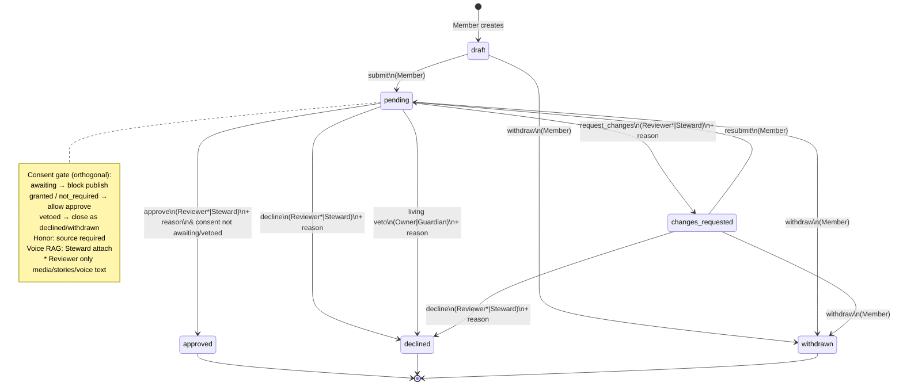
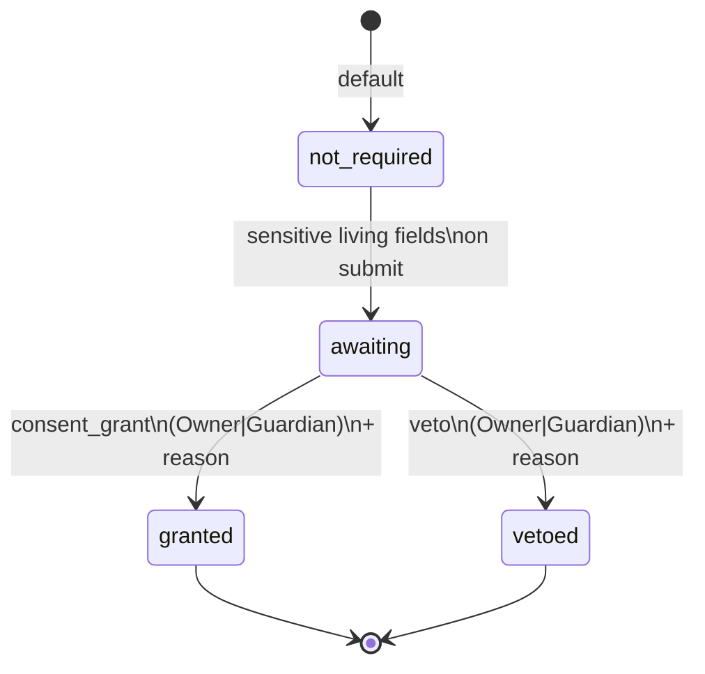

# ROOTLINE — Approval State Machine

**Deliverable E.** Workflow for **proposals** and **access claims**: states, who may transition, audit reasons, living-adult veto, honor-source rule, and voice “needs Steward attach” before RAG.

Shared status enum: `draft` → `pending` → `changes_requested` | `approved` | `declined` | `withdrawn`.

Orthogonal **consent gate**: `not_required` | `awaiting` | `granted` | `vetoed` (living owner, guardian for minors, profile steward when product requires).

---

## 1. States

| State | Meaning |
|-------|---------|
| **draft** | Author is still editing. Not in Steward queue. |
| **pending** | Submitted for review (and/or waiting on consent). |
| **changes_requested** | Reviewer/Steward asked for edits; author may revise and resubmit. |
| **approved** | Accepted onto the official tree / membership. Consent must be `not_required` or `granted`. Research-sandbox proposals **cannot** reach approved. |
| **declined** | Rejected with reason. Terminal unless product allows a new claim/proposal. |
| **withdrawn** | Author (or living owner via veto path closing the item) pulled it back. Terminal for that id. |

Consent gate does not replace status. Example: status `pending` + consent `awaiting` means Steward liked the content but cannot publish until the living adult (or guardian) grants.

---

## 2. Who can transition

| Actor | Scope |
|-------|-------|
| **Member** (proposer / claimant) | create draft; submit; edit in draft/changes_requested; withdraw |
| **Reviewer** | media, stories, voice **transcript text quality** — Approve / Request changes / Decline **only** for those kinds — not membership, roles, merges, exports, honor badges, or access claims |
| **Steward** (incl. Founding Steward) | all proposal kinds + access claims; merges; honor (with source); Steward attach for voice RAG; exports; roles |
| **Living profile owner** | consent_grant or **veto** on proposals that touch their living sensitive fields (address, social links, new photos, similar) |
| **Guardian** | for minors: account approval + visibility; consent_grant / veto on the child’s claim and sensitive proposals |
| **Profile steward** | for deceased: may be required alongside Steward for certain deceased-profile changes (product: Profile steward + Steward) |

Stewards **cannot** force-publish a living adult’s social links, address, or new photos without owner (or parent/guardian if minor) approval.

---

## 3. Audit reason required

Every transition that decides the item must write an `approvals` row and usually an `audit_events` row with a **non-empty reason**:

- approve  
- decline  
- request_changes  
- withdraw (reason may be short: “Author withdrew”)  
- veto  
- consent_grant  
- Steward voice **attach**  

UI: reason field is required before the primary button enables. Empty reason → reject at API.

---

## 4. Living-adult veto path

1. Member or Steward proposes a change that touches living sensitive fields → `consent_gate = awaiting`, living owner notified.  
2. Steward may review content while waiting, but **Approve to publish** stays blocked while `awaiting`.  
3. Living owner **consent_grant** → gate `granted`; Steward may then approve (if still pending) or auto-complete if policy bundles both.  
4. Living owner **veto** → gate `vetoed`, status `declined` or `withdrawn`, audit reason from owner. Steward cannot override.  
5. Minors: guardian plays the owner role for consent.

Charlie Hutson SAMPLE living profile with privacy ON: treat address/social/new photos as gated; Ask and public site must respect flags.

---

## 5. Honor badges require a source

- Proposal kind `honor_badge` must include a `source_id` (or create-source payload) before submit.  
- On apply: `honor_badges.source_id` is NOT NULL.  
- Unsourced military rank, unit, or medal → Steward **decline** or **request_changes** (“Add a source”). Ask Rootline must not invent ranks (see doc F).

---

## 6. Voice transcript: needs Steward attach before RAG

1. Elder records voice → media + `voice_memories` row.  
2. Auto transcript may land with `attach_status = needs_steward_attach` (or `pending_transcript` then that).  
3. Reviewer/Steward may approve the **story/media proposal** for member visibility.  
4. **`rag_eligible` remains false** until a Steward runs **attach** (link person/event/story + reason).  
5. Only then may Ask Rootline index the transcript. Unattached voice never answers kinship or biography questions.

---

## 7. Access claims (join Path B)

Same status enum. Differences:

| Step | Actor | Notes |
|------|-------|-------|
| Create / submit claim | Account holder | Name, relationship, optional voucher, docs |
| Request changes / Decline / Approve | **Steward only** | Reviewer cannot approve membership |
| Guardian consent | Guardian | Required before approve if `is_minor` |
| Invite redeem | Member or Steward code | Member-issued → Steward confirm (assumption); Steward-issued may auto-approve membership with audit |

Declined claimants may re-claim after cool-down (default 30 days per ASSUMPTIONS).

---

## 8. Proposal kinds → default reviewers

| Kind | Reviewer may decide? | Steward | Living consent if sensitive? |
|------|----------------------|---------|------------------------------|
| new_person | no | yes | if linked living fields |
| relationship | no | yes | rare |
| photo | yes (media) | yes | yes if living subject’s new photo |
| story | yes | yes | if about living & sensitive |
| voice_memory | yes (media/text); RAG attach = Steward | yes | as above |
| correction | no | yes | if living sensitive |
| social_link | no | yes | **always** living owner |
| honor_badge | no | yes (+ source) | n/a deceased typical |
| merge | no | yes | n/a |
| access_claim | no | yes | guardian if minor |

Research sandbox flag: theories stay off the official tree; cannot transition to **approved**.

---

## 9. Mermaid — proposals & claims

### Consent gate (orthogonal)

---

## 10. Two-Steward archive delete (related gate)

Not a proposal status, but the same audit discipline: god-mode delete of the archive requires typed confirmation **and** a second Steward’s approval row with reason. See Steward runbook (doc I).

---

*Document E of Rootline deliverables. Members propose; Stewards approve; reasons always leave a trail.*
